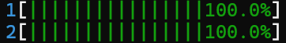
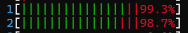
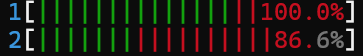
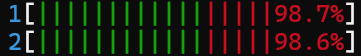

# 10 seconds

## spinlock:
    user time: 19970 [ms], system time 29 [ms]
    last stats: queue stats: current size 118; attempts: (63143260 125199311 -62056051); counts (63143260 63143142 118)

    total operations = 188.342.571

## mutex:
    user time: 12449 [ms], system time 7264 [ms]
    last stats: queue stats: current size 368; attempts: (31719417 77616582 -45897165); counts (31719417 31719049 368)

    total operations = 109.335.999
    

## cond_var:
    signal on add
    user time: 8314 [ms], system time 9277 [ms]
    last stats: queue stats: current size 1000000; attempts: (83094260 3501141 79593119); counts (4501141 3501141 1000000)

    total operations = 86.595.401

    signal on get
    user time: 9020 [ms], system time 8646 [ms]
    last stats: queue stats: current size 1; attempts: (3248373 141694889 -138446516); counts (3248373 3248372 1)

    total operations = 144.943.262

## sem:
    user time: 12643 [ms], system time 7153 [ms]
    last stats: queue stats: current size 479; attempts: (33919843 64736939 -30817096); counts (33919843 33919364 479)

    total operations = 98.656.782

